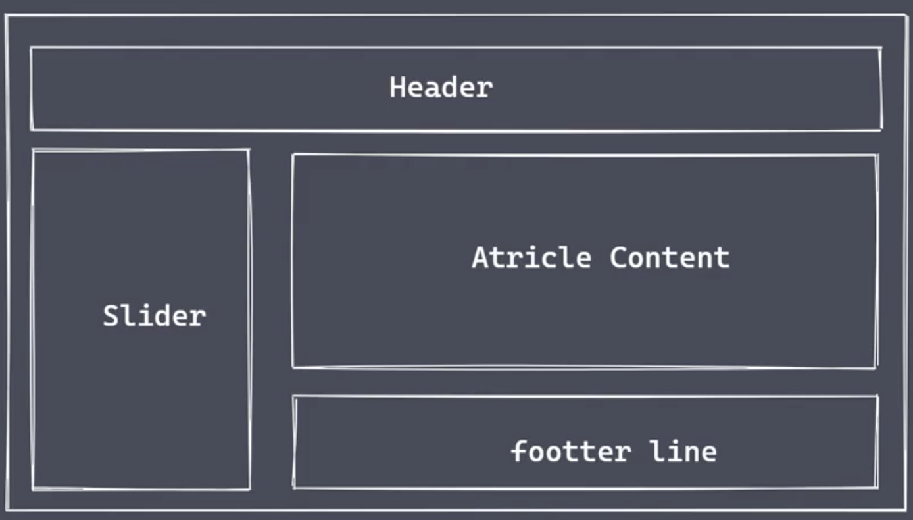
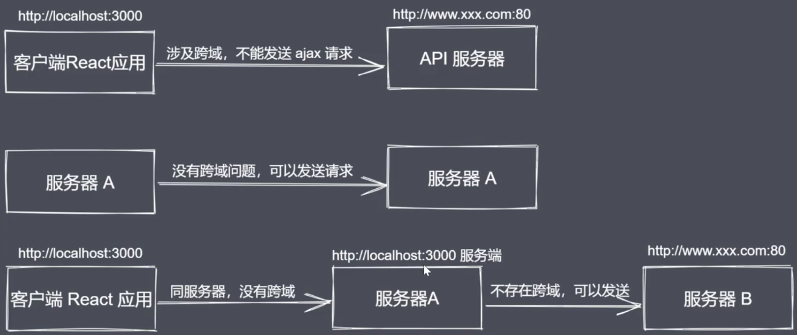
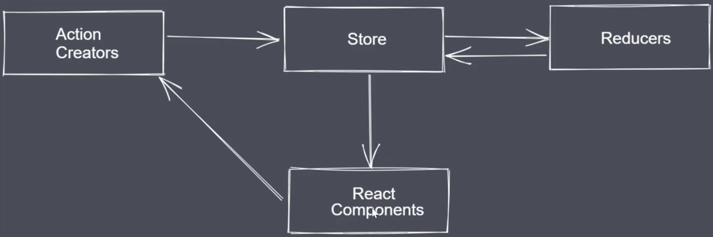
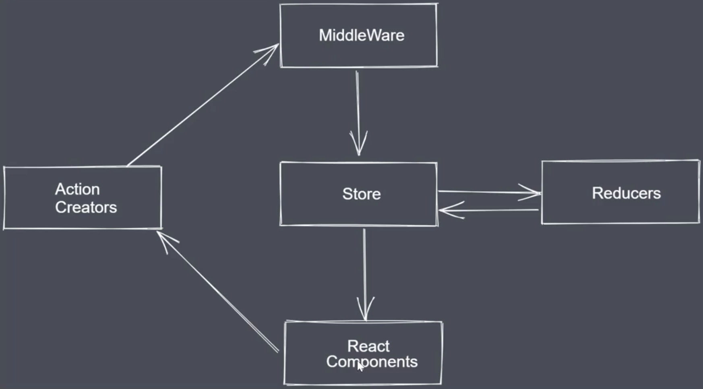
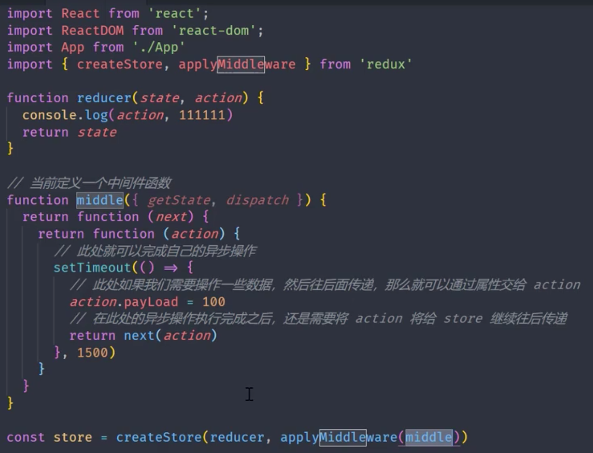

#### 1、组件化开发

组件：一块区域，包含了html、CSS和JS



组件开发优点：

1）将应用拆分成不同组件，相互独立，易于维护

2）组件复用，减少重复造轮子

#### 2、搭建react开发环境

##### 1）自定义webpack搭建

安装的包

```json
"devDependencies": {
    "@babel/core": "^7.15.8",
    "@babel/preset-env": "^7.15.8",
    "@babel/preset-react": "^7.14.5",
    "babel-loader": "^8.2.2",
    "html-webpack-plugin": "^5.3.2",
    "react": "^17.0.2",
    "react-dom": "^17.0.2",
    "webpack": "^5.58.1",
    "webpack-cli": "^4.9.0",
    "webpack-dev-server": "^3.11.2"
  }
```

webpack基本配置

```javascript
const path = require('path');
const HTMLWebpackPlugin = require('html-webpack-plugin');

module.exports = {
    mode:'development',
    entry:'./src/index.js',
    output:{
        filename:'main.js',
        path:path.resolve(__dirname,'dist')
    },
    devServer:{
        port:3000,
        hot:true
    },
    module:{
        rules:[
            {
                test:/\.js|jsx$/i,
                exclude:/node_modules/,
                use:{
                    loader:'babel-loader',
                    options:{
                        presets:['@babel/preset-env','@babel/preset-react']
                    }
                }
            }
        ]
    },
    plugins:[
        new HTMLWebpackPlugin({
            template:'./src/index.html'
        })
    ]
}
```

##### 2）脚手架初始化项目

底部实现是封装了webpack

```
// 全局安装
npm i -g create-react-app
// 创建项目
create-react-app 02.react
```

#### 3、JSX语法

##### 1）jsx是什么

- JSX是JavaScript 的语法扩展，既不是字符串也不是 HTML（return后面的叫做jsx）
- 它具有 JavaScript 的全部功能，同时可以被转为真实的DOM在界面上进行展示（react、react-dom）
- JSX本身是一个表达式，运行之后会有一个结果，可以将其赋值给变量、 当成参数传递、函数返回值等
- 

##### 2）功能举例

- 动态显示数据：{}

- 调用方法：自定义 + 内置

- 支持表达式，支持三元表达式

- 模版字符串

- 添加属性

  字符串属性，直接用双引号包裹

  动态属性

- 添加子元素

  jsx只允许有一个顶级元素 

  单标签必须正确关闭

```javascript
const name = 'react初体验';
const flag = true;
const obj = {
  name:'react初体验',
  age:100
};
const attri = '动态属性';

function sayHello(){
  return 'hello everyone';
}

function App() {
  return (
    <div>
      <div>React项目运行成功</div>
      {/* 动态显示数据 */}
      <p>{name}</p>
      <p>name</p>
      {/* 调用方法：自定义 + 内置 */}
      <p>{sayHello()}</p>
      <p>{console.log('hhhhh')}</p>
      <p>{Math.random()}</p>
      {/* 支持表达式，支持三元表达式 */}
      <p>{1+2+3}</p>
      <p>{flag?'登录的状态':'执行登录'}</p>
      {/* 模版字符串 */}
      <p>{`hello,${name}`}</p>
      {/* 对象不能直接打印，要转换为字符串 */}
      <p>{JSON.stringify(obj)}</p>
      {/* 添加动态属性 */}
      <p title={attri}>添加动态属性</p>
    </div>
  );
}

export default App;
```

#### 4、JSX事件操作

##### 1）事件绑定

驼峰命名直接添加={事件监听的名称}

##### 2）事件监听传参

a.利用箭头函数内部调用事件监听的时候传递实参

b.利用bind方法返回一个新的函数在事件发生时调用，此时也可传递参数

##### 3）获取事件对象

a.默认情况下不需要接收参数且直接执行事件监听时，第一个参数默认就是ev

b.利用箭头函数执行事件监听时，需要通过箭头函数将ev对象传递给事件监听函数

c.利用bind方法时，如果有传参，那么最后一个参数默认就是ev

#### 5、循环数据

JSX中可以直接将数组的数据解构

注意在循环中添加key，避免dom diff算法造成的问题

```javascript
const persons = [
  {
    id:1,
    name:'jingran',
    age:18
  },
  {
    id:2,
    name:'xiannv',
    age:28
  }
];
function App() {
  // newPersons相当于[<li>1</li>,<li>2</li>,<li>3</li>]
  const newPersons = persons.map((item) => {
    return (
      <li key={item.id}>{item.name}--{item.age}</li>
    );
  });
	return (<ul>{newPersons}</ul>);
};
```

#### 6、添加内联样式

- 设置样式时应该将键值对放置于{}
- 内联样式默认无法支持伪类及媒询样式设置
- 需利用radium

#### 7、设置外联样式

1）全局外联样式

所有组件都可以直接使用

2）组件级别外联样式

只有某一个组件可以使用

一般命名格式：组件名.module.css

3）CSS-IN-JS的解决方案

适用于较小的组件，只有一个JS文件即可，不需要配套的CSS文件

```javascript
// Test.js  Test组件
import style from './Test.module.css';
import styled from 'styled-components';

// CSS-IN-JS解决方案，适用于比较小的组件
// 自定义标签
const SectionDiv = styled.div.attrs({className:'box'})`
    width:100px;
    height:100px;
    background-color:hotpink
`

function Test(){
    return (
        <div>
            <div className={`box ${style.item}`}>Test组件</div>
            <SectionDiv />
        </div>
    );
}

export default Test;
```

#### 8、组件创建方式

##### 1）创建函数组件

##### 2）创建类组件

必须继承Component类，实现render方法

组件名称首字母大写，用于区分组件和普通标记

最外层要有根元素，为避免冗余嵌套的DOM，可使用占位符<Fragment></Fragment> / <></>

#### 9、向组件传递数据

- 方式一：在组件身上添加属性，然后传递数据
- 方式二：将数据统一管理，然后利用...操作直接传递给相应组件

根据组件的创建方式分两种情况看：

- 函数组件

  函数组件内参数部分定义一下，然后内部直接访问

- 类组件

  在类组件的内部存在一个props属性，外部传递的数据都放在这里保存

#### 10、props默认值及类型校验

函数组件:

组件名称.defaultProps来设置一个对象

```javascript
Test.defaultProps = {
    name:'Test组件默认name',
    title:'Test组件默认title'
};
Test.propTypes = {
    name:PropTypes.string,
    title:PropTypes.string
};
```

类组件：

直接定义static defaultProps来设置

```javascript
class About extends Component{
    // 定义props默认值
    static defaultProps = {
        name:'About组件默认name',
        title:'About组件默认title'
    };

    static propTypes = {
        name:PropTypes.string,
        title:PropTypes.string
    };

    render(){
        // 父组件向该组件传递的参数
        console.log(this);
        console.log(this.props);
        return (
            <Fragment>
                <p>{this.props.name}</p>
                <p>{this.props.title}</p>
          			{this.props.children}
            </Fragment>
        );
    }
}
```

#### 11、向组件传递JSX

改写成双标签，里面包含的内容就是向组件传递的JSX

在组件中用props.children接收

#### 12、组件布局实例

03.react

方式一：将页面的每部分拆分成一个组件，在App根组件中进行组合。

方式二：将页面的每部分拆分成一个组件，将固定部分（例如不变的头和尾）再次组合成新组件，变化部分放置占位符，通过向该新组件传递JSX组合成完整页面。

#### 13、组件状态

状态——数据

组件状态：某一个组件里面保存的自己的数据

```javascript
import React,{Component} from 'react';

class StateBtn extends Component{
    // 在类组件中存在一个state属性，它是一个对象，用来保存当前组件的数据
    // 之后可以通过setState方法来修改数据的值，最后修改后的状态会自动更新到页面上
    state = {
        name:'组件状态-组件自己的数据',
        value:Math.random()
    }

    // 易错：应写成箭头函数，里面的this代表上下文的this，即该StateBtn实例组件
    changeValue = () => {
        this.setState({
            value:Math.random()
        });
    }

    render(){
        return (
            <div>
                <p>{this.state.name}</p>
                <p>{this.state.value}</p>
                <button onClick={this.changeValue}>改变数据</button>
            </div>
        );
    }
}

export default StateBtn;
```

#### 14、setState使用

- setState是异步函数

  直接在后面是获取不到最新值的（同步执行）

  解决方法：

  - 调用setState的时候可以传入回调函数，在回调函数里获取新值
  - 使用async 与 await来解决异步执行的问题

- 除了可以传入对象外，还可以传递函数（形参为state，返回值是对象），两者有不同点

  ```javascript
  changeCount = () => {   
          // 传入函数（返回值是一个对象）时，多次操作会依次执行
          this.setState((state) => ({
              count:state.count+1
          }));
          this.setState((state) => ({
              count:state.count+5
          }));
  
          // 传入对象，多次操作会后面覆盖前面
          // this.setState({
          //     count:this.state.count + 5
          // });
  
          // this.setState({
          //     count:this.state.count + 1
          // });
  
      }
  ```

  

#### 15、组件中的this

前面也提到过没有使用箭头函数时，this指向出现问题

除了使用箭头函数外，也可以

- ```javascript
  <button onClick={()=>{this.changeValue()}}>改变数据</button>
  ```

- ```javascript
  <button onClick={this.changeValue.bind(this)}>改变数据</button>
  ```

  

#### 16、单向数据流动

- 单向数据流动，自顶向下，从父组件传到子组件
- 基于单向数据流动，要求将共享的数据定义在上层组件
- 子组件通过调用父组件传递过来的方法可以更改数据
- 当数据发生改变后，React会重新渲染组件树

#### 17、受控表单值绑定与更新

类似于Vue的表单控制（数据双向驱动）

- 受控表单

  表单元素的值全部交由react管理，值都放在state中，表单元素的值也需要从state中获取

  通过setState方法修改（猜想底部实现基于setter、getter）

- 做法

  （1）将state中的状态与表单的value值进行绑定

  ```javascript
  changeForm = (ev) => {
          // console.log(ev.target.name);
          // console.log(ev.target.value);
          const prop = ev.target.name;
          this.setState({
              [prop]:ev.target.value
          });
      }
  
  <input value={this.state.name} onChange={this.changeForm} name='name'/>
  ```

  （2）  更新，ev.target.value 和 this.setState联用

  （3）只是展示作用时，defaultValue和readOnly

- 下拉框

- 单选框

- 复选框

  前面数据绑定通过state和setState实现

  复选框通过和模拟数据源绑定实现

  最终提交时，state  + 复选框选中ID 一起提交

```javascript
import React,{Component} from 'react';

class ControlForm extends Component{
    state={
        subject:'javascript',
        sex:'女'
    }

    // 模拟数据源
    hobbies = [
        {
            id:1,
            title:'Vue',
            isChecked:true
        },
        {
            id:2,
            title:'React',
            isChecked:false
        },
        {
            id:3,
            title:'Anguler',
            isChecked:false
        }
    ]

    changeCheckbox = (id,ev)=>{
        // console.log(id);
        // console.log(ev.target.checked);
        this.hobbies[id-1].isChecked = ev.target.checked;
    }

    // 表单提交
    submit = (ev) =>{
        ev.preventDefault();
        // 将当前结果:state状态 + 复选框的选择情况（ID）
        let resCheckbox = this.hobbies.filter((item) => item.isChecked)
        .map((item) => item.id);
        console.log({...this.state,resCheckbox});
    }

    render(){
        return (
            <form onSubmit={this.submit}>
                <p>下拉框</p>
                <select value={this.state.subject} onChange={(ev)=>{this.setState({subject:ev.target.value})}}>
                    <option value='python'>python</option>
                    <option value='c++'>c++</option>
                    <option value='javascript'>javascript</option>
                </select>
                {/* 检验state中的subject值是否发生改变 */}
                <button onClick={()=>{console.log(this.state.subject)}}>输出state.subject值</button>

                <p>单选框</p>
                <input type='radio' name='sex' value='男' defaultChecked={this.state.sex === '男'} onChange={(ev)=>{this.setState({sex:ev.target.value})}}/><span>男</span>
                <input type='radio' name='sex' value='女' defaultChecked={this.state.sex === '女'} onChange={(ev)=>{this.setState({sex:ev.target.value})}}/><span>女</span>
                <button onClick={()=>{console.log(this.state.sex)}}>输出state.sex值</button>

                <p>复选框</p>
                {
                    this.hobbies.map((item)=>{
                        return (
                            <label key={item.id}>
                                <input type='checkbox' value={item.title} defaultChecked={item.isChecked} onChange={this.changeCheckbox.bind(this,item.id)}/>{item.title}
                            </label>
                        );
                    })
                }
                <button onClick={()=>{console.log(this.hobbies)}}>输出复选框的选中状态</button>
                <br />
                <input type='submit' />
            
            </form>
        );
    }
}

export default ControlForm;
```

#### 18、非受控表单

表单元素里的数据不受react管理，直接从DOM元素本身进行获取

- 第一步：获取DOM元素
- 第二步：获取具体的值

```javascript
import React,{Component} from 'react';

class UncontrolForm extends Component {

    submit = (ev)=>{
        ev.preventDefault();
        // console.log(ev);
        // console.log(this);
        console.log(this.refs.username.value);
    }

    render(){
        return (
            <form onSubmit={this.submit}>
                <input type='text' ref='username'/>
                <input type='submit' />
            </form>
        );
    }
}

export default UncontrolForm;
```

#### 19、简单管理系统练习

#### 20、React组件生命周期

生命周期函数（钩子）：预设的函数，在对应的时间点上被自动调用，不需要手动触发

##### 1）挂载：组件被创建 -> 插入到DOM中 

**生命周期方法：**

- constructor  设置组件的初始配置

- render  解析JSX，渲染DOM，在界面上展示

- componentDidMount  组件挂载完成

  发送网络请求

  添加定时器

  添加事件监听

  DOM操作

##### 2）更新：数据发生变化，组件需被重新渲染

数据：外部传入的Props以及自身管理的状态

**生命周期方法：**

- shouldComponentUpdate(nextProps,nextState)  组件是否更新

  默认返回的是true

  如果此方法返回false，那么后续的方法就不会再执行

- render  解析JSX，渲染DOM，在界面上展示

- componentDidUpdate  组件更新完成后执行

##### 3）卸载：将组件从DOM中删除

**生命周期方法：**

componentWillUnMount  将卸载组件相关的事件监听、定时器等清除

#### 21、react发送Ajax请求

 使用成熟的Ajax第三方库——axios

```javascript
import React,{Component} from 'react';
import axios from 'axios';

class Compo2 extends Component{
    constructor(){
        super()
        this.state = {
            users:[]
        }
    }
    render(){
        return (
            <div>
                <p>axios数据请求</p>
                {
                    this.state.users.map((item) => {
                        return (
                            <div key={item.id}>
                                <span>User&nbsp;&nbsp;{item.login}</span>&nbsp;&nbsp;
                                <span>URL&nbsp;&nbsp;{item.avatar_url}</span>
                            </div>
                        )
                    })
                }
            </div>
        );
    }
    async componentDidMount(){
        console.log('Compo2组件挂载完成了');
        //axios采用promise的形式处理返回数据
        // axios.get('https://api.github.com/users').then((res)=>{
        //     console.log(res.data);
        // })
        const data = await axios.get('https://api.github.com/users').then((res)=> res.data);
        console.log(data);
        this.setState({
            users:data
        })
        
    }
}

export default Compo2;
```

#### 22、react请求转发



请求转发：

服务端与服务端是不存在跨域问题的

客户端应用发请求给同源的服务端，服务端将请求转发给API服务器端

方法：

- package.json配置proxy
- http-proxy-middleware


#### 23、mock数据 

模拟数据行为

#### 24、Redux工作流程

单向数据流，顶层向底层组件传递数据和修改方法，造成组件之间通信困难

Redux是React中进行数据管理的模块/包，它提供了一个叫store的统一数据存储的仓库

store就像一个数据管理的中间人，让组件之间无须再直接进行数据传递



- Store

  对象类型：存储数据、更新视图

  保存数据的地方，你可以把它看成一个容器。整个应用只能有一个 Store

  Redux 提供`createStore`这个函数，用来生成 Store。

  ```javascript
  import { createStore } from 'redux';
  const store = createStore(fn);
  ```

- Action Creators

  对象类型： 存储数据的操作行为

  State 的变化，会导致 View 的变化。但是，用户接触不到 State，只能接触到 View。所以，State 的变化必须是 View 导致的。Action 就是 View 发出的通知，表示 State 应该要发生变化了。

  ```javascript
  const action = {
    type: 'ADD_TODO',
    payload: 'Learn Redux'
  };
  ```

  上面代码中，Action 的名称是`ADD_TODO`，它携带的信息是字符串`Learn Redux`。

  Action 描述当前发生的事情。改变 State 的唯一办法，就是使用 Action。它会运送数据到 Store。

- Reducer

  函数类型：接收action的行为，处理数据，再把处理后的数据返回给store

#### 25、创建store和reducer

```javascript
// Counter.reducer.js
import React,{Component} from 'react';

function reducer(){
    return {
        count:10
    }
}

export default reducer;
```

创建store

```javascript
import {createStore} from 'redux';
import {Provider} from 'react-redux';

const store = createStore(CounterReducer);
.
.
.
render(){
    console.log('App组件的render执行了');
    return (
      <Provider store={store}>
        <div>
          <p>这是App组件</p>
          <span>{this.state.count}</span>
          <button onClick={this.handler}>加1</button>
          <hr />
          <button onClick={()=>{this.setState({isShow:!this.state.isShow})}}>切换Compo1</button>
          { this.state.isShow && <Compo1 />}
          <hr />
          <Compo2 />
          <hr />
          <Counter />
      </div>
      </Provider>
    );
```

```javascript
// Counter.js
import React from 'react';
import {connect} from 'react-redux';

function Counter(props){
    console.log(props)
    return (
        <div>
            <button>-</button>
            <span>{props.count}</span>
            <button>+</button>
        </div>
    );
}

const mapStateToProps = state => ({
    count:state.count
})

export default connect(mapStateToProps)(Counter)
```

#### 26、组件修改store数据

```javascript
// reducer的创建——接收action的行为，处理数据，再把处理后的数据返回给store
const initialState = {
    count:10
}

function reducer(state=initialState,action){
    // 没有state传来时返回默认initialState
    // 有state传来时在原来的基础上进行修改
    console.log(action);
    switch(action.type){
        case 'decrement':
            return{
                count:state.count - 1
            }
        case 'increment':
            return{
                count:state.count + 1
            }
        default:
            return state;
    }
}

export default reducer;
```

用户通过dispatch方法传action给reducer改变数据,reducer将改变后的数据返回给store

```javascript
import React from 'react';
import {connect} from 'react-redux';

function Counter(props){
    console.log(props)
    return (
        <div>
            <button onClick={()=>{props.dispatch({type:'decrement'})}}>-</button>
            <span>{props.count}</span>
            <button onClick={()=>{props.dispatch({type:'increment'})}}>+</button>
        </div>
    );
}

const mapStateToProps = (state) => ({
    count:state.count
})

export default connect(mapStateToProps)(Counter)
```

#### 27、提取action代码为函数

向connect函数传入第二个参数，对dispatch方法封装映射到props

```javascript
import React from 'react';
import {connect} from 'react-redux';

function Counter(props){
    console.log(props)
    return (
        <div>
            <button onClick={props.decrement}>-</button>
            <span>{props.count}</span>
            <button onClick={props.increment}>+</button>
            <button onClick={()=>{props.increment_n(5)}}>+5</button>
        </div>
    );
}

// 从state中取数据映射到props上
const mapStateToProps = (state) => ({
    count:state.count
})
// 对dispatch方法进行封装映射到props上
const mapDispatchToProps = (dispatch) => ({
    // 函数组对象
    increment(){
        dispatch({type:'increment'})
    },
    decrement(){
        dispatch({type:'decrement'})
    },
    increment_n(){
        dispatch({type:'increment_n',payload:5})
    }
})

export default connect(mapStateToProps,mapDispatchToProps)(Counter)
```

#### 28、自动生成action触发函数

bindActionCreators函数可以自动生成action触发函数

```javascript
// Counter.action.js
export const increment = ()=> ({type:'increment'})
export const decrement = ()=> ({type:'decrement'})
export const increment_n = (payload)=> ({type:'increment_n',payload})
```

```javascript
// Counter.js
import React from 'react';
import {connect} from 'react-redux';
import {bindActionCreators} from 'redux';
import * as counterActions from '../store/actions/Counter.action';

function Counter(props){
    console.log(props)
    return (
        <div>
            <button onClick={props.decrement}>-</button>
            <span>{props.count}</span>
            <button onClick={props.increment}>+</button>
            <button onClick={()=>{props.increment_n(6)}}>+6</button>
        </div>
    );
}

// 从state中取数据映射到props上
const mapStateToProps = (state) => ({
    count:state.count
})

// 对dispatch方法进行封装映射到props上
// const mapDispatchToProps = (dispatch) => ({
//     // 函数组对象
//     increment(){
//         dispatch({type:'increment'})
//     },
//     decrement(){
//         dispatch({type:'decrement'})
//     },
//     increment_n(payload){
//         dispatch({type:'increment_n',payload})
//     }
// })

// bindActionCreators函数可以自动生成action触发函数
// counterActions 函数组对象，bindActionCreators将其分别与dispatch绑定后，返回的仍是函数组对象
const mapDispatchToProps = (dispatch)=>(bindActionCreators(counterActions,dispatch))

export default connect(mapStateToProps,mapDispatchToProps)(Counter)
```

#### 29、设置action类型常量

将type中的字符串提取为常量，统一管理

#### 30、reducer的拆分与合并

为什么拆分：一个应用会有很多个组件，每个组件都有自己的数据，依据组件对reducer进行拆分

利用combineReducers函数，将多个reducer合并到一起，返回一个所有数据组成的对象

（一个应用只有一个store管理所有的数据，创建时只能传递一个reducer）

```javascript
import {combineReducers} from 'redux';
import CounterReducer from './Counter.reducer';
import PersonReducer from './Person.reducer';

export default combineReducers({
    counter:CounterReducer,
    person:PersonReducer
})
```

#### 31、redux工作流程梳理

核心：处理数据

1. 创建store保存数据关联reducer
2. 利用Provider将store向后传递
3. 在具体的组件当中使用connect方法获取store里保存的数据，并通过组件的props进行访问
4. 当拿到数据后就可以在界面上渲染了
5. 修改数据时触发dispatch传递action给reducer，reducer处理数据后返回给store，store返回给组件，组件重新渲染

优化：

1. 合并处理数据的所有reducer交给store统一管理
2. 让react自动的创建action执行的函数
3. 将action类型使用的字符串定义为常量

#### 32、redux中间件工作流程



异步操作交给中间件实现，将action拦截下来完成一些操作后再交给store

中间件是个函数，核心是对数据进行操作



#### 33、redux-thunk异步解决方案

thunk——中间件（工具包），里面完成异步行为（发送请求加载数据等）

使用了thunk，action里面可以返回一个函数，而不一定是对象{type:,payload}

#### 34、redux-saga异步解决方案

#### 35、简化action与reducer